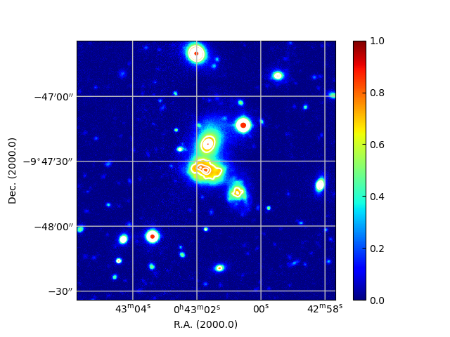

# Plots astronomical imaging with Maputils
The project contains example tests using the [__Maputils__](https://www.astro.rug.nl/software/kapteyn/maputilstutorial.html) module of Python, dedicated to inspecting and manipulating FITS data. The module uses functions of [__Kapteyn__](https://www.astro.rug.nl/software/kapteyn/index.html) and [__Matplotlib__](https://matplotlib.org/) packages to extract and display FITS image data.

Example:

The output image in __Overlay_image.py__ code. *The overlay image of A87 cluster with different world coordinate system.*

